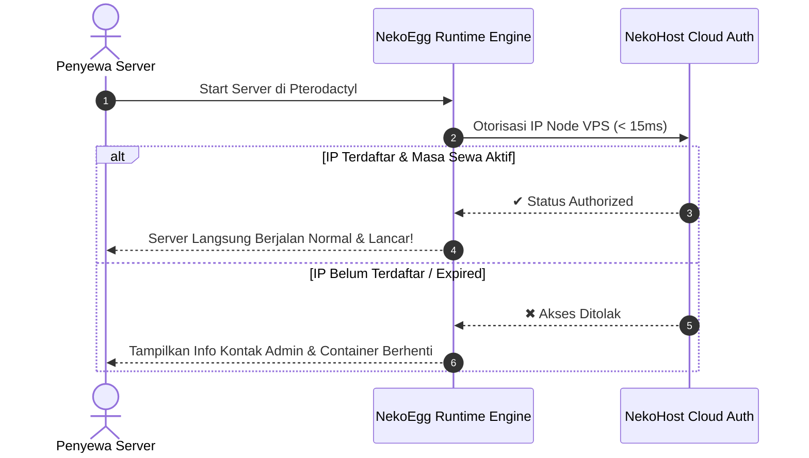

<div align="center">

# 🐾 NEKOEGG
### The Ultimate All-in-One Multi-Runtime Environment for Pterodactyl & Pelican

[](https://pterodactyl.io/)
[](https://github.com/Galang-Purnama/nekoegg)
[](https://nekohost.id)
[](https://nekohost.id)
[](https://nekohost.id)

<p align="center">
  <b>Satu Egg untuk Segala Kebutuhan: WhatsApp Bot, Discord Bot, Web Scraper, AI Automation, REST API, hingga Caching Database.</b><br>
  <i>Dilengkapi sistem keamanan Host Anti-Abuse dan verifikasi lisensi node otomatis tanpa ribet.</i>
</p>

[🌐 Website Resmi](https://nekohost.id) • [💬 Order via WhatsApp](https://wa.me/6281319859673) • [✈️ Komunitas Telegram](https://t.me/GalangP_Dev)

---

</div>

## 📑 Daftar Navigasi

- [✨ Mengapa Memilih NekoEgg?](#-mengapa-memilih-nekoegg)
- [⚔️ Perbandingan: NekoEgg vs Egg Biasa](#️-perbandingan-nekoegg-vs-egg-biasa)
- [📦 Ekosistem Runtime & Toolchain Lengkap](#-ekosistem-runtime--toolchain-lengkap)
- [🔄 Cara Kerja Otorisasi IP (Zero-Config)](#-cara-kerja-otorisasi-ip-zero-config)
- [🚀 Panduan Instalasi (Import Egg)](#-panduan-instalasi-import-egg)
- [🛡️ Proteksi Keamanan Server Host (Anti-Abuse)](#️-proteksi-keamanan-server-host-anti-abuse)
- [⌨️ Pintasan CLI & Utility Bawaan](#️-pintasan-cli--utility-bawaan)
- [📞 Pemesanan & Aktivasi Lisensi Node](#-pemesanan--aktivasi-lisensi-node)

---

## ✨ Mengapa Memilih NekoEgg?

- **⚡ Multi-Runtime All-in-One**  
  Bebas jalankan Node.js (20–26), Bun, Deno, Python (3.10–3.14), Golang, PHP (8.1–8.4), dan Redis dalam satu server tanpa perlu gonta-ganti Docker image.

- **🌐 Zero-Config Node Authorization**  
  Otorisasi lisensi otomatis berbasis IP VPS secara instan (< 15ms). Penyewa tidak perlu repot memasukkan kode lisensi manual di panel.

- **🎬 Multimedia & Web Scraping Ready**  
  Google Chromium Headless (Puppeteer/Playwright), FFmpeg, ImageMagick, libvips, dan yt-dlp sudah siap pakai untuk pengolahan media dan scraping.

- **🛡️ Enterprise Host Anti-Abuse Shield**  
  Menjaga server host tetap aman dengan proteksi aktif anti-crypto mining, filter torrent (DMCA), anti-DDoS, dan pembatasan proses (anti-fork bomb).

- **🚀 Kecepatan Instalasi Ekstrem**  
  Dilengkapi package manager generasi terbaru seperti **Astral `uv`** (Python), **Bun**, **PNPM**, dan **Composer 2** yang 10–100x lebih cepat dari installer biasa.

---

## ⚔️ Perbandingan: NekoEgg vs Egg Biasa

| Fitur / Kemampuan | 🐾 NekoEgg Commercial | Egg Standar / Publik |
| :--- | :---: | :---: |
| **Dukungan Bahasa** | ✅ **Semua Bahasa (Node, Bun, Deno, Python, Go, PHP, Redis)** | ❌ Hanya 1 Bahasa (Node *atau* Python saja) |
| **Browser Headless** | ✅ **Chromium C++ Ready + Noto Color Emoji** | ❌ Sering error library Puppeteer/Playwright |
| **Audio/Video Rendering** | ✅ **FFmpeg + SoX + Libopus + yt-dlp Lengkap** | ❌ Terbatas / Tanpa FFmpeg |
| **Proteksi Host Node** | ✅ **Active Anti-Mining, Anti-Torrent & Anti-DDoS** | ❌ Rentan Abuse (Mining, Torrent, Flooder) |
| **Sistem Lisensi** | ✅ **Pure IP-Based Whitelisting Otomatis** | ❌ Manual input key yang rawan bocor |
| **Package Manager Cepat**| ✅ **Astral `uv` + Bun + PNPM + Composer** | ❌ Standar (npm / pip biasa) |

---

## 📦 Ekosistem Runtime & Toolchain Lengkap

### 1. 🟨 JavaScript & TypeScript
* **Node.js (NVM Managed):** Versi `20.x`, `22.x`, `24.x`, `25.x`, dan `26.x` *(Default: 26)*
* **Package Managers:** `npm`, `yarn`, `pnpm` (lengkap alias `pn`, `pnx`, `pnpx`)
* **Modern Runtimes:** **Bun** v1.x (Ultra Fast) & **Deno** v1.x / v2.x
* **Process Managers:** `pm2` & `nodemon` bawaan

### 2. 🐍 Python Ecosystem
* **Python Versions:** `3.10`, `3.11`, `3.12`, `3.13`, dan `3.14` *(Default: 3.14)*
* **High-Speed Package Manager:** **Astral `uv` & `uvx`** (Instalasi requirements dalam hitungan detik)
* **Standard Tooling:** `pip`, `setuptools`, `wheel`, `virtualenv`

### 3. 🔷 Golang & PHP
* **Golang Compiler:** Go `1.22`, `1.23`, `1.24`, `1.25`, dan `1.26` *(Default: 1.26)*
* **PHP Engine:** PHP `8.1`, `8.2`, `8.3`, dan `8.4` (Lengkap ekstensi: `curl`, `mbstring`, `gd`, `zip`, `sqlite`, dll)
* **Dependency Manager:** **Composer 2**

### 4. 🗄️ Database & In-Memory Cache
* **Redis Server:** Server Redis internal bawaan (bisa dijalankan via background service)
* **SQLite:** SQLite3 CLI & C Header files
* **Database Clients:** MySQL / MariaDB Client & PostgreSQL Client CLI

### 5. 🎬 Multimedia, Scraping & Networking
* **Browser Headless:** Google Chromium teroptimasi dengan seluruh dependensi C++ Puppeteer/Playwright
* **Multimedia Suite:** `ffmpeg`, `sox`, `imagemagick` (`convert`), `webp` (`cwebp`), `libvips`, `librsvg2`
* **Media Downloader:** `yt-dlp` terpasang
* **Tunneling:** Cloudflare Zero Trust Tunnel (`cloudflared`), Bore TCP (`bore`), Localtunnel (`lt`)

---

## 🔄 Cara Kerja Otorisasi IP (Zero-Config)

Tidak ada file konfigurasi lisensi yang membingungkan bagi penyewa:



---

## 🚀 Panduan Pemasangan (Import Egg)

### Bagi Pemilik Hosting (Admin Pterodactyl / Pelican):

```text
Langkah 1: Masuk ke Admin Panel Pterodactyl -> Nests -> Pilih Nest Anda.
Langkah 2: Klik tombol "Import Egg" dan pilih file "egg.json".
Langkah 3: Pastikan kolom Docker Image mengarah ke:
           ghcr.io/galang-purnama/nekoegg:latest
Langkah 4: Simpan. Seluruh server baru kini siap dibuat menggunakan NekoEgg!
```

---

## 🛡️ Proteksi Keamanan Server Host (Anti-Abuse)

NekoEgg dilengkapi sistem sandboxing multi-lapis aktif untuk menjamin server host Anda tidak disalahgunakan:

* 🚫 **Anti-Crypto Mining Watchdog:** Mematikan paksa script miner (*XMRig, minerd, stratum*, dll).
* ⚖️ **DMCA Torrent Filter:** Memblokir protokol BitTorrent (*qBittorrent, transmission, deluged*) demi keamanan hukum host.
* 🛡️ **Anti-DDoS Flooder:** Menangkal eksekusi script penyerang jaringan (*UDP flood, slowloris, LOIC*).
* 🔒 **CD-Jail Restriction:** Membatasi akses user agar tetap terisolasi di dalam direktori `/home/container`.
* ⚡ **Anti-Fork Bomb:** Membatasi alokasi maksimal proses (`nproc 156`) demi stabilitas CPU host.
* 🕵️ **Hidden Malware Detector:** Memindai eksekusi binary mencurigakan dari direktori temporary.

---

## ⌨️ Pintasan CLI & Utility Bawaan

| Perintah | Deskripsi Fungsi |
| :--- | :--- |
| `refresh` / `sysinfo` | Menampilkan dashboard info sistem, pemakaian CPU/RAM, dan status runtime |
| `ff` | Menjalankan Fastfetch untuk ringkasan arsitektur sistem |
| `myip` | Memeriksa IP publik VPS keluar secara instan |
| `ports` | Memeriksa port jaringan yang sedang listening / aktif |
| `clean-cache` | Membersihkan cache npm, yarn, pnpm, pip, uv, composer & deno |
| `pm2-save` | Menyimpan daftar proses PM2 agar otomatis auto-restart |
| `cls` | Membersihkan layar konsol terminal |

---

## 📞 Pemesanan & Aktivasi Lisensi Node

Tertarik menggunakan NekoEgg untuk hosting Anda atau ingin mendaftarkan IP node baru?

* 🌐 **Website Resmi:** [https://nekohost.id](https://nekohost.id)
* 💬 **WhatsApp Admin:** [https://wa.me/6281319859673](https://wa.me/6281319859673)
* ✈️ **Telegram Dukungan:** [https://t.me/GalangP_Dev](https://t.me/GalangP_Dev)

---

<div align="center">
  <b>© 2026 NekoHost.id • All Rights Reserved</b><br>
  <i>Empowering High-Performance Runtimes with Next-Gen DRM Protection.</i>
</div>
